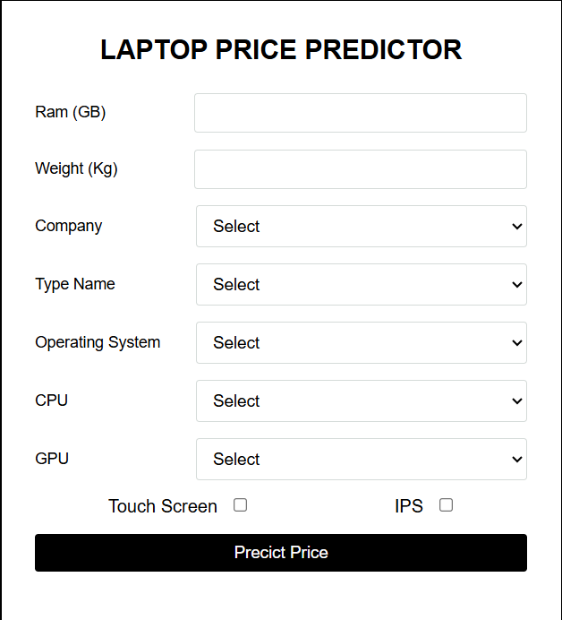

# Laptop Price Predictor 💻📊

Laptop Price Predictor is a Machine Learning based web application built on a Flask server. It predicts laptop market prices based on user-selected hardware specifications such as RAM, Weight, CPU, GPU, Operating System, and Display features.

---

## 📷 Application Preview



---

## 📌 Project Overview

When purchasing a laptop, prices vary significantly depending on dynamic hardware configurations. This project provides an automated, machine learning solution to estimate fair laptop market prices in real-time based on specific hardware combinations.

* **Core Framework:** Flask Web Server
* **Best ML Model:** Random Forest Regressor ($R^2 \approx 0.79$)
* **Optimization:** Hyperparameter Tuning via `GridSearchCV`
* **User Interface:** Clean, single-page web form built with HTML & CSS
* **Currency Output:** Scaled to Sri Lankan Rupees (LKR)

---

## 🛠️️ Tech Stack & Libraries

* **Backend Server:** Flask (Python)
* **Machine Learning:** Scikit-Learn (Linear Models, Trees, Ensembles, GridSearchCV)
* **Data Handling:** Pandas, NumPy
* **Model Serialization:** Pickle
* **Frontend UI:** HTML5, CSS3

---

## 📂 Repository Structure

```text
Laptop-Price-Predictor/
│
├── model/
│   ├── env/                        # Virtual environment for ML development
│   ├── laptop_price.csv            # Dataset
│   ├── price_predictor.ipynb       # Data preprocessing, EDA & ML Model Evaluation
│   ├── predictor.pickle            # Saved Best Machine Learning Model
│   └── appRequirements.txt        # ML dependencies
│
├── website/
│   ├── static/
│   │   └── style.css               # Frontend Styling
│   ├── templates/
│   │   └── index.html              # Web Interface Template
│   ├── model/
│   │   └── predictor.pickle        # Model loaded by Flask server
│   └── app.py                      # Flask Application Entry Point
│
├── image.png                       # UI Screenshot
├── README.md                       # Documentation
└── .gitignore